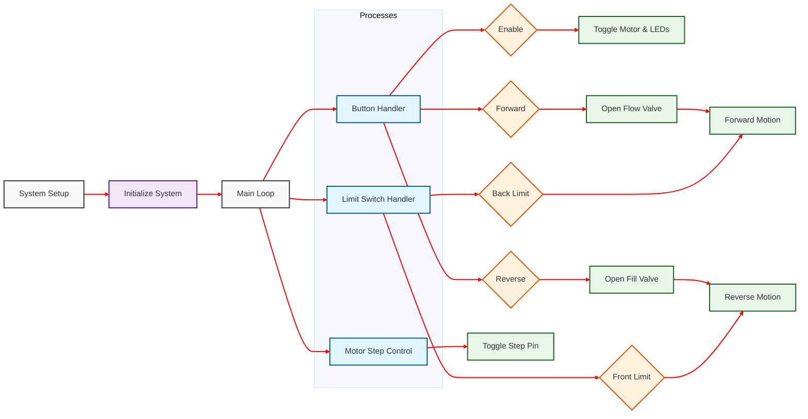

# Logic

```mermaid
%%{
  init: {
    'theme': 'base',
    'themeVariables': {
      'fontFamily': 'arial',
      'fontSize': '16px'
    },
    'flowchart': {
      'nodeSpacing': 50,
      'rankSpacing': 50,
      'curve': 'basis'
    },
    'htmlLabels': true,
    'securityLevel': 'loose',
    'viewport': {
      'width': 1200,
      'height': 600
    }
  }
}%%

flowchart LR
    %% Styling
    classDef default fill:#f9f9f9,stroke:#333,stroke-width:2px
    classDef process fill:#e1f5fe,stroke:#01579b,stroke-width:2px
    classDef decision fill:#fff3e0,stroke:#e65100,stroke-width:2px
    classDef action fill:#e8f5e9,stroke:#1b5e20,stroke-width:2px
    classDef init fill:#f3e5f5,stroke:#4a148c,stroke-width:2px
    
    linkStyle default stroke:#FF0000,stroke-width:2px

    Setup[System Setup] --> Init[Initialize System]:::init
    Init --> Loop[Main Loop]
    
    subgraph Processes[" Processes"]
        direction TB
        P1[Button Handler]:::process
        P2[Limit Switch Handler]:::process
        P3[Motor Step Control]:::process
    end
    
    Loop --> P1 & P2 & P3
    
    P1 --> B1{Enable}:::decision
    P1 --> B2{Forward}:::decision
    P1 --> B3{Reverse}:::decision
    
    B1 --> M1[Toggle Motor & LEDs]:::action
    B2 --> F1[Open Flow Valve]:::action
    F1 --> F2[Forward Motion]:::action
    B3 --> R1[Open Fill Valve]:::action
    R1 --> R2[Reverse Motion]:::action
    
    P2 --> L1{Front Limit}:::decision
    P2 --> L2{Back Limit}:::decision
    L1 --> R2
    L2 --> F2
    
    P3 --> MS[Toggle Step Pin]:::action
```
